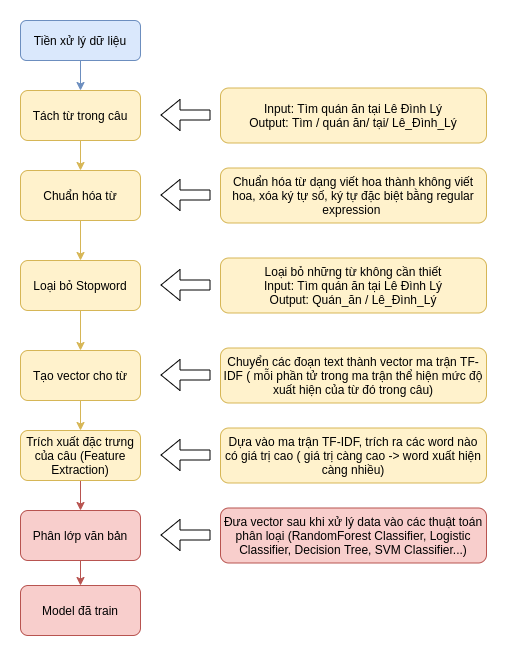
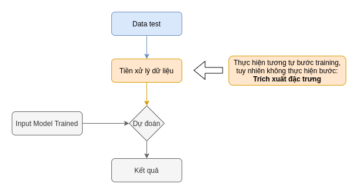
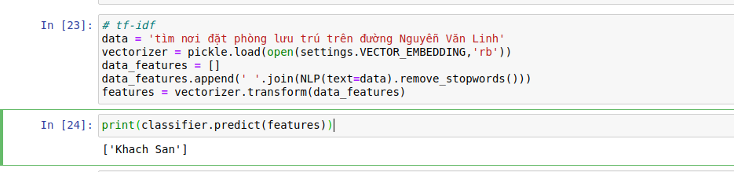

# Vietnamese-Text-Classification
Vietnamese Text Classification

## 1. Mục tiêu:

 Cải thiện chức năng tìm kiếm. Chức năng này sử dụng Natural Language Processing (NLP) phân tích dữ liệu nhập vào và dự đoán ý muốn của người sử dụng đang tìm kiếm cái gì để đưa ra đề xuất thông minh.

  *Ví dụ*: Người sử dụng nhập "Tìm quán ăn ở đường Lê Đình Lý, Đà Nẵng" vào thanh tìm kiếm. Trả về  danh sách kết quả: các **quán ăn** nằm trên đường **Lê Đình Lý, Đà Nẵng** và lân cận.

## 2. Phân tích:

 Mục tiêu chia làm 2 phần:

  * Phần 1: Dự đoán nội dung nhập vào là loại địa điểm gì. Hiện tại, Viettel Maps có 8 loại địa điểm: **Nhà Hàng**, **Khách sạn**, **Quán cafe**, **ATM**, **Siêu thị**, **Ăn vặt, vỉa hè**, **Ngân hàng**, **Bưu điện** (ngoài ra, trong CSDL Postgresql còn có thêm 8 loại khác như sân bay, etc. nhưng ta chưa cần xét các loại đó trong này). 
  * Phần 2: Chuyển đổi tên địa điểm, địa danh riêng thành lat, long.

Sau đó truyền 2 tham số: ***Loại địa điểm*** và **lat,long** vào API Autocomplete (đã có sẵn trong public API Viettel Maps) như sau:

```python
'https://api.viettelmaps.com.vn:8080/gateway/searching/v1/place-api/autocomplete?input='+Loại địa điểm+'&center='+lat,long+'&access_token=YOUR_TOKEN_VALUE'
```

## 3. Điều kiện đảm bảo đầu vào và đầu ra:

Data input dạng string và đáp ưng cùng tiêu chuẩn input của chức năng Search Engine.

Data output cùng kết quả trả về với API Autocomplete.

## 4. Các bước đã tiến hành:

Chỉ mới thực hiện phần 1. Quy trình xử lý như sau:

* Bước training: quy trình thực hiện



* Bước dự đoán:



Khi triển khai lên server chính, chỉ triển khai mỗi bước dự đoán, model sẽ được train sẵn từ dưới local.

## 5. Một số kết quả đạt được:

Hiện tại mới build 2 nhãn: **Nhà Hàng** và **Khách sạn**.

 

Độ chính xác hiện tại là 100%. Tuy nhiên con số này chưa đúng hoàn toàn vì data dùng để train và test chưa hoàn thiện (còn ít).

  
## 6. Công việc tiếp theo:

- [x] Tiếp tục Xây dựng data dựa theo 8 nhãn ở trên (SEO keyword):
  - [x] Nhà hàng
  - [x] Khách sạn
  - [x] Quán Cà Phê
  - [x] ATM
  - [x] Siêu thị
  - [x] Ăn Vặt, vỉa hè
  - [x] Ngân hàng
  - [x] Bưu điên
- [x] Tiến hành build lại dựa trên data bổ sung.
- [ ] Clean data train. 
- [ ] Thực hiện phần 2. Phần này chỉ thực hiện 1 bước là phân loại từ loại của câu rồi trích loại "danh từ riêng". Ví dụ: "Tìm quán ăn ở Lê Đình Lý, Đà Nẵng" thì cụm từ "Lê Đình Lý, Đà Nẵng" là cụm danh từ riêng. Trích xuất cụm này rồi bỏ vào 1 API public của Viettel Maps sẽ nhận được tọa độ tâm lat,long. Còn nếu không có tên riêng gì trong text nhập vào thì mặc định là lat,long của người sử dụng.


## 7. Build:

## Chương trình phân loại 
- Chạy chương trình phân loại 1 văn bản bất kì (model đã tồn tại trong train_model): 
```
python predict.py -i <filename document>
```
------

## BUILD DATA

-- WORKING --